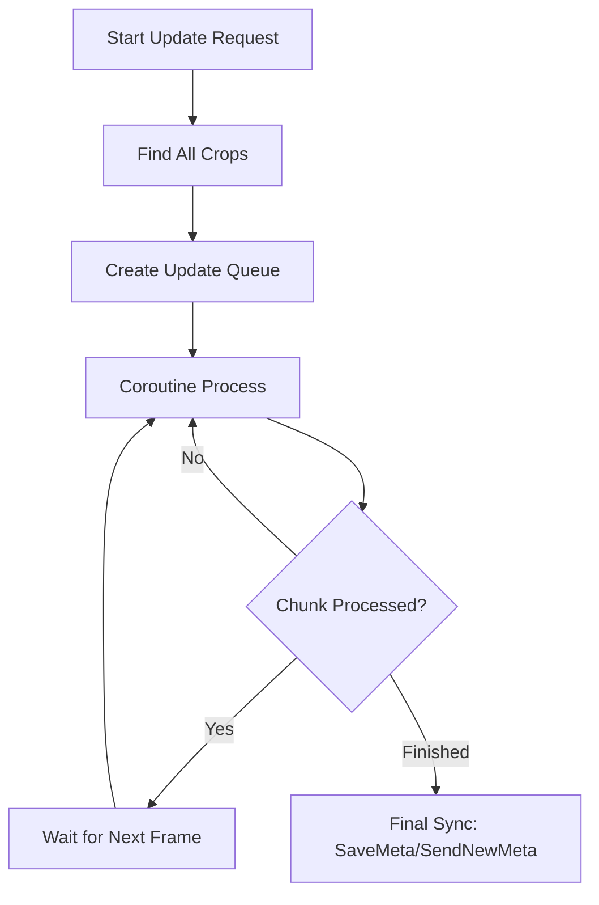

# Unified Totems Optimization Plan

## Problem Statement
The current implementation of `ApplyTotemEffectsToAll` and `RemoveTotemEffectsFromAll` performs synchronous bulk updates across all crops in a scene. While necessary for global totem effects, this causes significant performance degradation (frame spikes) and excessive network traffic due to individual `SaveMeta()` and `SendNewMeta()` calls per crop.

## Proposed Architecture
We will implement a **Deferred Batch Processing System** using the existing `CoroutineRunner` to spread the load over multiple frames.

### 1. Deferred Processing Flow
Instead of iterating and saving synchronously, we will:
1.  Identify all relevant target crops.
2.  Queue the update task in a coroutine.
3.  Process the updates in chunks (e.g., 20-50 crops per frame).
4.  Perform the `SaveMeta()` and `SendNewMeta()` at the end of the batch or after the entire scene has been processed, minimizing network calls.

### 2. State Synchronization
*   Ensure `EvaluateEnhancedTotemsInScene` is only triggered via a throttled event (e.g., a simple debounce) when placing/removing totems to prevent re-evaluating the whole scene multiple times in a single frame.

## Action Plan
- [x] Refactor `ApplyTotemEffectsToAll` and `RemoveTotemEffectsFromAll` to return a `System.Collections.IEnumerator`.
- [x] Utilize `CoroutineRunner.instance.StartCoroutine` to execute the update.
- [x] Implement batch chunking (process X items per frame).
- [x] Consolidate metadata saving to be more efficient.

# Future Performance Improvements
- [x] Refactor `GetNearbyScarecrowEffectsPrefix` to avoid redundant `SaveMeta()`/`SendNewMeta()` calls by caching effects or using a lazy evaluation/dirty-flag system.
- [x] Reduce the frequency of `SaveMeta()`/`SendNewMeta()` in `TotemHandler` by batching changes per frame instead of per-application.